

# WS2812B Scrolling Text, with Simulated Fire

This project uses an PIC18F47K42 with a HPC Development board driving a 8x32 array of WS2812B individually addressable RGB LEDs to generate a variety of patterns, including a spinner, fire, shimmer, and scrolling text.
This projects highlights the advanced array of Core Independent Peripherals (CIP) available on Microchip 8-bit PIC devices, including ADCC (Analog to Digital Converter with Computation), CLC (Configurable Custom Logic),
PWM (Pulse Width Modulation), SPI (Serial Peripheral Interface), and Timers. Furthermore, this project shows how custom timing protocols, such as the one employed by the WS2812B can be implemented in peripherals, making it possible to use an 8-bit MCU for this task.

## Related Documentation

 [WS2812B Datasheet](http://www.world-semi.com/Certifications/WS2812B.html)

 Some related project examples:  
[RGB lighting with WS2812 using SPI and CCL](https://mplab-discover.microchip.com/v1/item/com.microchip.ide.project/com.microchip.subcategories.modules-and-peripherals.system-modules.Others/com.microchip.mcu8.mplabx.project.avr128da48-cnano-ws2812-mplab-mcc/1.0.1?view=about&s0=ws2812)  
[Using the Configurable Logic Cell (CLC) to Interface a PIC16F1509 and WS2811 LED Driver](https://ww1.microchip.com/downloads/en/AppNotes/00001606A.pdf)

## Software Used

- MPLAB® X IDE 5.50 or newer [(microchip.com/mplab/mplab-x-ide)](http://www.microchip.com/mplab/mplab-x-ide)
- MPLAB XC8 2.36 or a newer compiler [(microchip.com/mplab/compilers)](http://www.microchip.com/mplab/compilers)
- MPLAB Code Configurator (MCC) 5.0.3 or newer [(microchip.com/mplab/mplab-code-configurator)](https://www.microchip.com/mplab/mplab-code-configurator)
- MPLAB Code Configurator (MCC) Device Libraries PIC10 / PIC12 / PIC16 / PIC18 MCUs [(microchip.com/mplab/mplab-code-configurator)](https://www.microchip.com/mplab/mplab-code-configurator)
- Microchip PIC18F-K Series Device Support (1.6.125) or newer [(packs.download.microchip.com/)](https://packs.download.microchip.com/)

## Hardware Used

- [PIC18F47K42 PDIP](https://www.microchip.com/en-us/product/PIC18F47K42)
- Curiosity HPC Development Board [(DM164136)](https://www.microchip.com/en-us/development-tool/dm164136)

A custom PCB was made to use the MikroBUS&trade; socket on the Curiosity HPC Development Board. The Altium files produced are part of this repository.

## Setup

A PIC18F47K42 DIP is plugged into the DIP socket on the Curiosity HPC Development Board.
A custom PCB was made to fit the MikroBUS socket on the Curiosity HPC Development Board.
This PCB has terminal blocks for power supply input and output to the array of WS2812B RGB LEDs.

|	Signal						  |	Microcontroller Pin |
|---------------------------------|---------------------|
|  Analog Hue					  |	RA1					|
|  Analog Brightness   			  |	RA0					|
|  CLC1 Output	  				  |	RC6					|
|  Switch 1 (s1)				  |	RB4					|
|  LED1		  					  |	RA4					|
|  LED2			  				  |	RA5					|
|  LED3		  					  |	RA6					|
|  LED4				  			  |	RA7					|
|  SPI SCK1				  		  |	RC3					|
|  SPI SDI1			  			  |	RC4					|
|  SPI SDO1				  		  |	RC2					|

     
Project Setup     
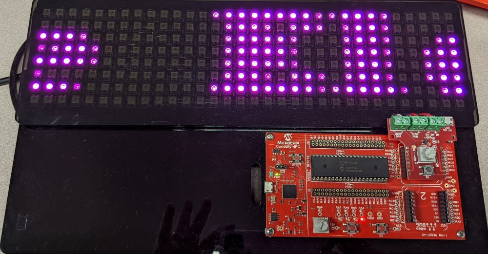

## Operation

The WS2812B requires the use of a custom protocol. To send a '1' or '0', the user must send a HIGH pulse and then a LOW pulse as shown in the image below.
To send a RET code requires a LOW pulse as shown below. Image taken from WS2812B datasheet.   
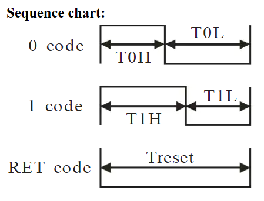

Refer to the image below for timing specifications for sending a '1', '0', and RET code. Image taken from WS2812B datasheet.   
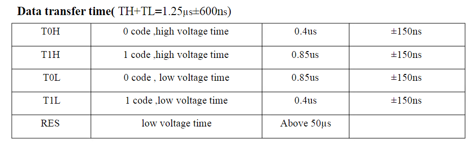

WS2812B RGB LEDs are cascaded as shown in the image below. Image taken from WS2812B datasheet.   
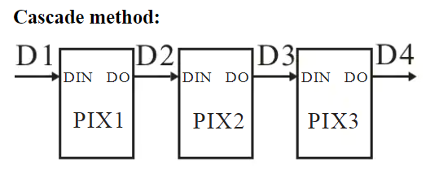

To achieve the specific timing requirements for the WS2812B using an 8-bit MCU, PWM, SPI, and CCL peripherals were used to generate the specific waveforms.

### ADCC Module Configuration:

The ADCC configuration in this example was used to measure the analog voltage from 2 potentiomenters, one for hue, the other for brightness of the WS2812B array.
The peripheral was configured to take single measurements for each of the two channels used, with VDD as the positive reference, VSS as the negative reference, and using left alignment.
The selected clock source was FOSC/ADCLK and the clock used was FOSC/64. This gave the time to complete 1 bit conversion (TAD) as 1µs, a sampling frequency of 86.96 kHz and a conversion time of 11.5µs.
See image below for ADCC setup.   
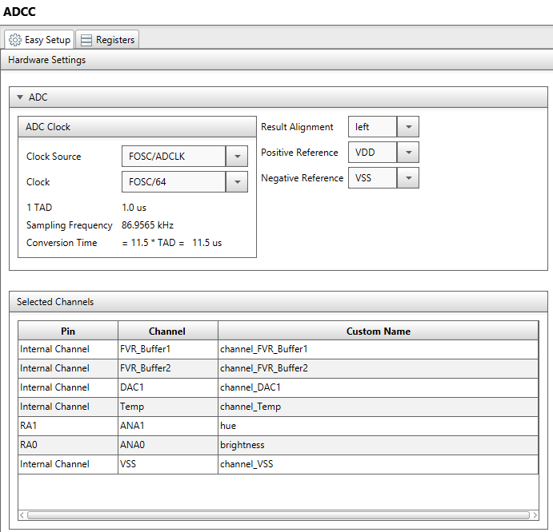

### TMR1 Timer Configuration:

TMR1 was set up with a period of 20 ms. This was achieved by using the clock source of FOSC/4, with a prescaler of 1:8, and TMR1 was synchronized to the system clock.
This timer is used in the main.c file to update the display functions.
See image below for TMR1 setup.    
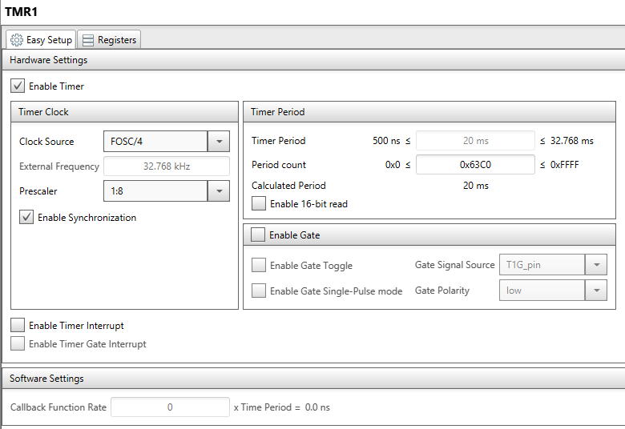  

### TMR2 Timer Configuration:

TMR2 was set up with a period of 630 ns. This was achieved by using the clock source of FOSC/4, with a prescaler of 1:1, and a requestion period of 630 ns.
This yielded an actual period of 625 ns.
See image below for TMR2 setup.    
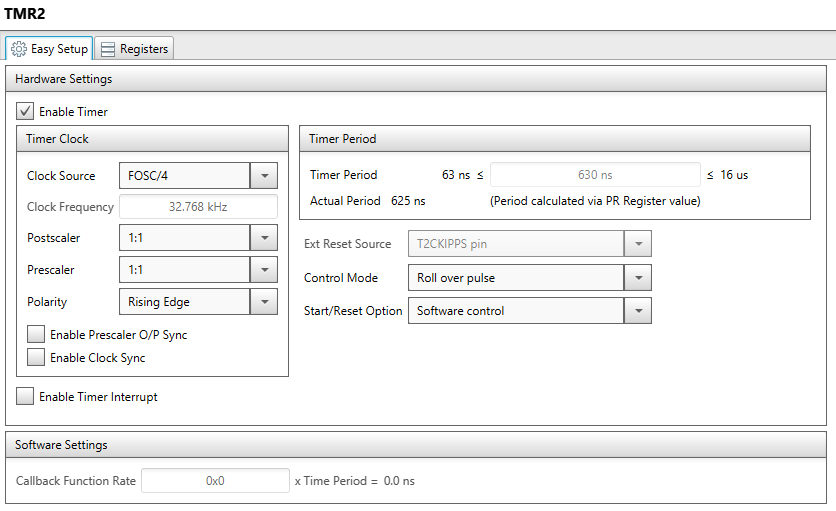

### PWM5 Configuration:

PWM5 used TMR2 as its base timer with a duty cycle of 25%. This gives a HIGH time of 156.25 ns and a LOW time of 468.75 ns.
See image below for PWM5 setup.    
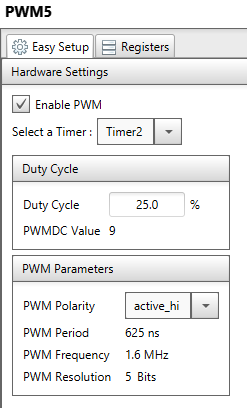

### PWM6 Configuration:

PWM6 used TMR2 as its base timer with a duty cycle of 66%. This gives a HIGH time of 412.5 ns and a LOW time of 212.5 ns.
See image below for PWM6 setup.    
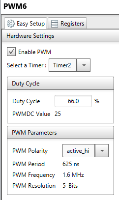

### SPI1 Configuration:

SPI1 was set up in SPI Master mode, with input data sampled at the middle. Clock polarity was Idle:Low and Active:High. Clock edge was idle to active.
The SPI clck source was TMR2_Postscaled, resulting in a SPI clock of 800 kHz.
See image below for SPI1 setup.      
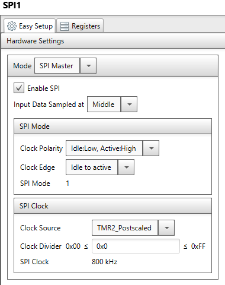

### CLC1 Config:

CLC1 was used to put together the following signals to create the custom protocol required for the WS2812B: SPI1 SCK, SPI1 SDO, PWM5, PWM6.
The mode selected was AND-OR.
See image below for CLC1 setup.    
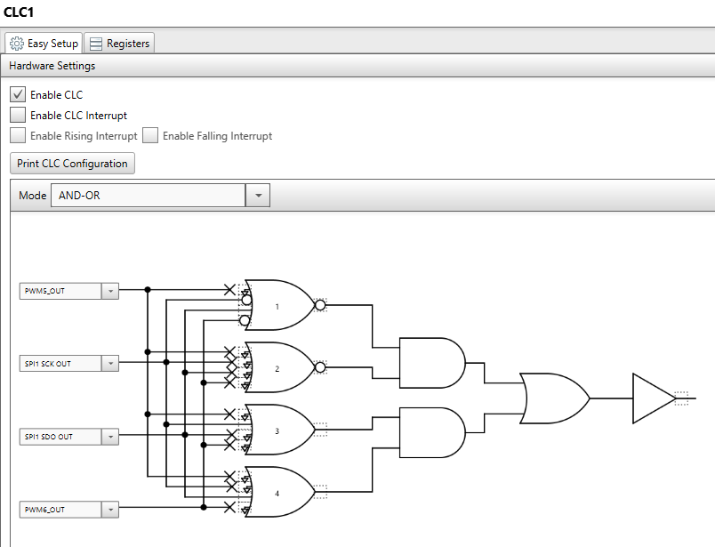

## Summary

This example shows how to drive a WS2812B 8x32 RGB LED array using the PIC18F47K42.
